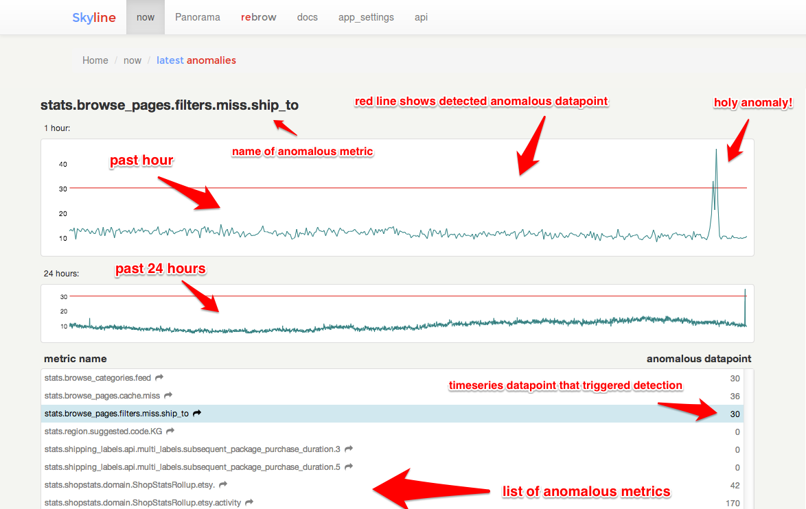

## Skyline

Skyline is a near real-time anomaly detection system, built to enable
passive monitoring of hundreds of thousands of metrics, without the need
to configure a model/thresholds for each one, as you might do with Nagios.
It is designed to be used wherever there are a large quantity of
high-resolution timeseries which need constant monitoring. Once a metrics
stream is set up (from StatsD or Graphite or another source), additional
metrics are automatically added to Skyline for analysis. Skyline's easily
extended algorithms attempt to automatically detect what it means for each
metric to be anomalous.

## Documentation

All the Skyline documentation is available in a clone locally in your
browser at `file://<PATH_TO_YOUR_CLONE>/docs/_build/html/index.html`, via
the Skyline Webapp frontend and online at http://earthgecko-skyline.readthedocs.io/en/latest/
(maybe if it is set up)
